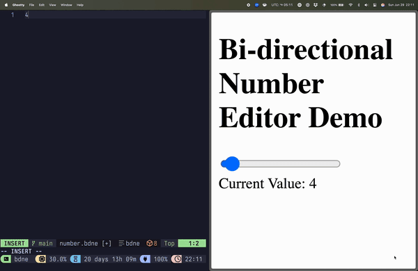

# bdne: bidirectional number editor

This repo contains a demonstration of bidirectional editing between a text
document and a web interface, facilitated by an LSP server.



It was inspired by [Kevin Lynagh's updates on his work on
codeCAD](https://kevinlynagh.com/newsletter/2025_06_03_prototyping_a_language/).

This is meant to be a proof-of-concept for one way you might implement
bidirectional editing in a CAD system that allows for editing via either a text
file or a graphical UI, keeping each in sync with the other.

## How does it work?

[The LSP server](lsp-server.ts) is not just an LSP server. It also serves the
web client over HTTP and communicates with the web client over a WebSocket.

```
┌───────────────┐         ┌──────────────┐           ┌───────┐
│               │   LSP   │              │   HTTP    │       │
│  Text Editor  │ ◄─────► │  LSP Server  │ ◄───────► │  GUI  │
│               │         │              │ WebSocket │       │
└───────────────┘         └──────────────┘           └───────┘
```
