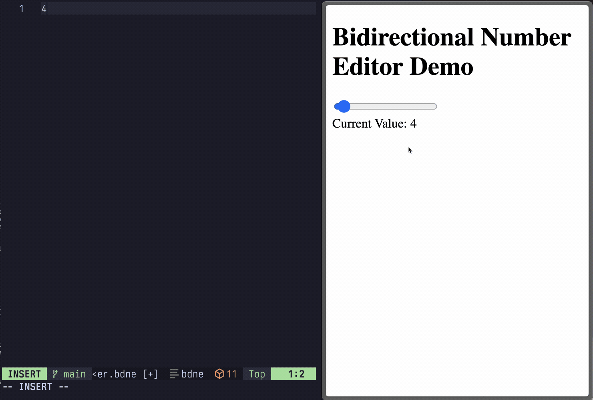

# bdne: bidirectional number editor

This repo contains a demonstration of bidirectional editing between a text
document and a web interface, facilitated by an LSP server.

[Blog post with more info](https://jamesbvaughan.com/bidirectional-editing/)



It was inspired by [Kevin Lynagh's updates on his work on
codeCAD](https://kevinlynagh.com/newsletter/2025_06_03_prototyping_a_language/).

This is meant to be a proof-of-concept for one way you might implement
bidirectional editing in a CAD system that allows for editing via either a text
file or a graphical UI, keeping each in sync with the other.

## How does it work?

[The LSP server](lsp-server.ts) is not just an LSP server. It also serves the
web client over HTTP and communicates with the web client over a WebSocket.

```
┌───────────────┐         ┌──────────────┐           ┌───────┐
│               │   LSP   │              │   HTTP    │       │
│  Text Editor  │ ◄─────► │  LSP Server  │ ◄───────► │  GUI  │
│               │         │              │ WebSocket │       │
└───────────────┘         └──────────────┘           └───────┘
```

The language server expects a file whose entire contents are a single number.

This keeps things incredibly simple for this demo because I'm just reading and
writing the entire file for each change, but language servers are capable of
much more structured and targeted editing.
It's easy to imagine a more complex language where the values relate to
parameters in a CAD model that can be manipulated in either direction like this.

## How to try it out

Here's the config I'm using for Neovim:

```lua
local lspconfig = require("lspconfig")
local configs = require("lspconfig.configs")

-- Add a "bdne" filetype for *.bdne files
vim.filetype.add({ extension = { bdne = "bdne" } })

-- Tell Neovim how to use this server
configs.bdne = {
  default_config = {
    cmd = { "bun", "/Users/james/code/bdne/lsp-server.ts", "--stdio" },
      filetypes = { "bdne" },
      root_dir = function()
      return vim.loop.cwd()
    end,
  },
}

-- Tell Neovim to use this server
lspconfig.bdne.setup({})
```

I'm not familiar with the LSP clients in other editors, but I'd expect something
similar to be necessary.
